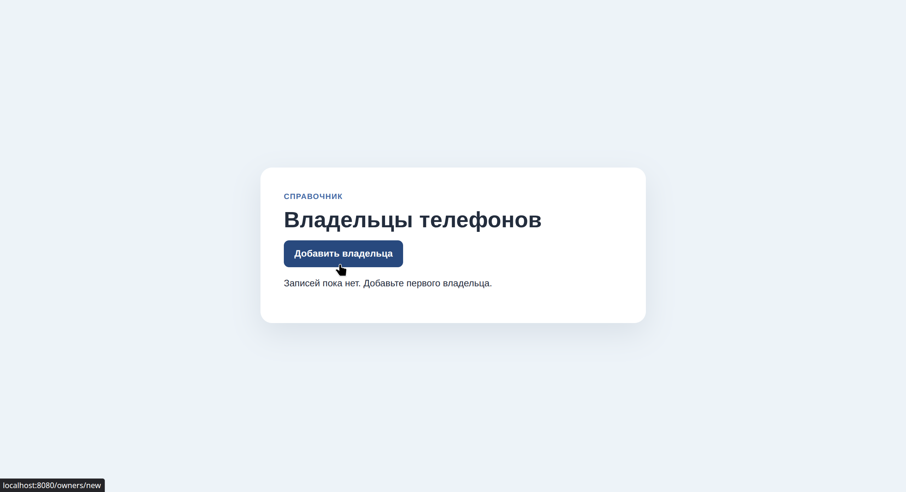
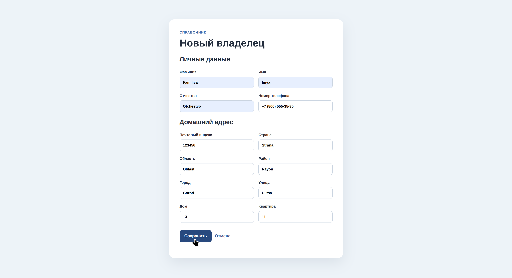
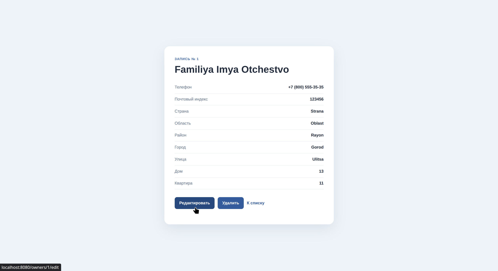

# Лабораторная работа № 2 - Spring Data JPA

## Цель работы

Изучить работу Spring Data JPA с базой данных H2 и репозиторием. Реализовать приложение для ведения записей о владельцах телефонов: добавление, просмотр, изменение и удаление данных.

## Архитектура проекта

- **Стек:** Java 17, Spring Boot 3, Maven, Spring Web, Spring Data JPA, Thymeleaf.
- **СУБД:** H2 в памяти (`jdbc:h2:mem:institut`). PostgreSQL в проекте не используется.
- **Основные слои:**
  - `PhoneOwnerController` - обрабатывает HTTP-запросы и передаёт данные в шаблоны;
  - `PhoneOwnerRepository` - расширяет `CrudRepository` и предоставляет операции чтения, сохранения и удаления;
  - `PhoneOwner` - JPA-сущность владельца телефона с личными данными, адресом и номером телефона;
  - `templates` - страницы списка, формы и подробной информации; `static/css/style.css` содержит оформление.
- **Ключевые аннотации:** `@SpringBootApplication` запускает приложение; `@Entity`, `@Table`, `@Id` и `@GeneratedValue` описывают сущность и её ключ; `@Controller` отмечает контроллер; `@GetMapping` и `@PostMapping` связывают обработчики с HTTP-запросами; `@PathVariable` получает ID из URL; `@ModelAttribute` связывает поля формы с объектом владельца.

## Алгоритм работы

1. При переходе на `/` приложение перенаправляет пользователя на список владельцев `/owners`;
2. Контроллер запрашивает записи у `PhoneOwnerRepository` и отображает их в таблице. Если список пуст, страница сообщает об этом;
3. Для создания записи пользователь открывает `/owners/new` и заполняет ФИО, адрес и номер телефона. POST-запрос `/owners` сохраняет новую сущность в H2 и открывает её страницу;
4. Ссылка «Подробнее» открывает `/owners/{id}`. Если запись с таким ID отсутствует, приложение возвращает пользователя к списку;
5. Из подробной страницы можно открыть `/owners/{id}/edit`. POST-запрос `/owners/{id}` сохраняет изменения только если запись существует;
6. Удаление выполняется POST-запросом `/owners/{id}/delete`; перед удалением приложение проверяет наличие записи и затем возвращает пользователя к списку;
7. Веб-консоль H2 доступна по адресу `/h2-console`.

## Скриншоты работы приложения

### Список владельцев

### Форма добавления владельца

### Добавление записи

